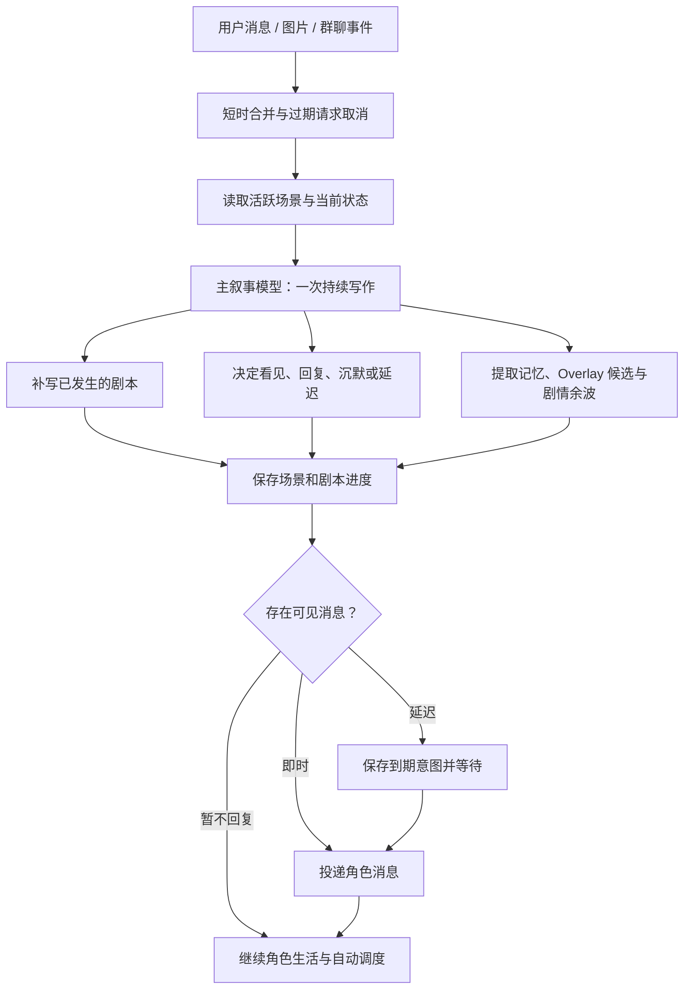

# HDS Interlude / 幕间系统

> 聊天在幕前发生，生活在幕间继续。

HDS Interlude 是一个面向 Koishi 一对一与多参与者场景的持续叙事聊天框架。它让用户消息、角色的沉默、延迟回复、主动联系和自动推进，都成为同一段生活剧本中自然可见的部分，并由一次主叙事写作连贯地决定。

当前版本：`0.1.4-beta3`（测试版）。提供持续生活剧本、结构化投递、群聊意愿、多提供商模型连接与可选聊天动作。

## 文档导航

- 第一次安装和测试：[BEGINNER_GUIDE.md](BEGINNER_GUIDE.md)
- 从零部署 QQ 角色：[DEPLOYMENT_GUIDE.md](DEPLOYMENT_GUIDE.md)
- 逐项配置说明：[CONFIGURATION_GUIDE.md](CONFIGURATION_GUIDE.md)
- 管理员命令：[command.md](command.md)
- 当前架构：[docs/ARCHITECTURE.md](docs/ARCHITECTURE.md)
- Alter System 设计与运行规则：[docs/ALTER_SYSTEM.md](docs/ALTER_SYSTEM.md)
- Agency Window 设计与运行规则：[docs/AGENCY_WINDOW.md](docs/AGENCY_WINDOW.md)
- 版本记录：[docs/CHANGELOG.md](docs/CHANGELOG.md)
- 安全与依赖说明：[docs/SECURITY.md](docs/SECURITY.md)
- 历史分析、失败版本与调试资料：[docs/README.md](docs/README.md)

## 它解决什么问题

HDSI 以主角为中心维护持续剧情状态：角色拥有日程、关系、待办、情绪、配角和未完成事件；用户消息作为进入这段现实的一项事件，参与角色当下的判断与后续生活。

这套框架让角色从既有生活出发，自然决定何时看见消息、是否愿意回复、如何回应，以及这件事会给后续生活留下怎样的影响。

## 核心结构

### 一个主剧本，多位参与者

一个机器人账号维护一个 Canonical Story（主剧本）。多个已授权用户可以进入同一主剧本，但每位参与者保留独立的资料、初始关系、关系演化和近期互动状态。

这样，角色可以在不同账号之间安排注意力、兑现约定，或自然地表达自己正被其他事情占用；所有互动都汇入同一个稳定的人格与生活轨迹。

### 活跃场景是短期连续性的来源

每次主叙事写作都会读取当前活跃场景中最近发生的真实条目：用户 / 群聊事件、已成功投递的角色消息、剧本段落与必要的场景摘要。它保留原始对话的语义、说话顺序和时间信息，同时通过字符预算控制上下文规模。

当前用户事件在本轮以“当前事件”身份出现一次；自动推进则以纯粹的生活推进展开。这个边界让旧消息保持历史位置，也让尚未投递的角色台词始终停留在“未说出口”的状态。

### 固定阶段，连续生活

HDSI 不以时间间隔切换写作尺度，而是按当前事件进入四种明确阶段：用户消息、对话后续、到期意图与独立生活推进。每一轮都从故事游标补写已经经过的时间，并以当前 `nowLocal` 结束；调度间隔只决定何时唤醒写作，不会预设剧情的密度、情绪或篇幅。

这让同一段生活能自然容纳即时对话、被打断的输入、承诺到期、安静的对话余波和较长的自动推进。未来内容始终以意图、计划或延迟动作保存，已经送达的私聊则同时保留在剧本与结构化投递记录中。

每次主请求都会同时发送 UTC 与故事本地时间，并将 `nowLocal` 的日期、时分秒、星期、时段和日照预期作为权威端点。重载或长间隔后的 continuity 用于衔接上次状态，当前时钟则为新一轮剧情提供准确锚点；例如 `Asia/Shanghai` 的 16:00 会按仍有日光的下午处理。

## 一次消息如何变成剧情



```text
用户发送消息 / 图片
        ↓
2 秒短时合并（连续消息合成同一轮）
        ↓
读取活跃场景、当前状态、关系、记忆、待办与剧情引子
        ↓
主叙事模型一次写作：补写已发生时间 + 处理当前事件 + 决定可见行为
        ↓
保存剧本、场景进度、记忆候选、关系变化与未来意图
        ↓
按即时 / 延迟 / 不回复投递角色消息
```

新消息遵循“首条回复提交”边界：主模型尚未提交第一条消息时，新输入会接管本轮，并与旧消息批次合并后重新写作；第一条已经提交后，新输入会截断尚未发送的 `<sep/>` 后续气泡。被截断的文字会作为“主角本来想发送，但还没打完字，新消息就到了”的未完成意图交给替代写作，清晰地区分已说出口的对话与被打断的念头。

## 主叙事模型的职责

主模型是核心写作者，在一次调用中完成“补写故事、判断是否回复、写出回复”等连续工作。每次调用会同时生成：

1. 当前时间段内已经发生的剧本；
2. 对当前用户事件、到期意图或自动推进的处理；
3. 是否已看见、回复模式、消息内容及计划发送时间；
4. 长期事实、状态变化、Overlay 候选、剧情余波和未来意图。

结构化输出中的互动决策形如：

```json
{
  "seen": true,
  "reply": {
    "mode": "immediate",
    "content": "怎么了"
  }
}
```

模型输出可使用 `<sep/>` 拆分消息。插件会按下一段文字长度模拟短暂输入时间；用户在等待期间继续发言时，旧分段计划会被取消并重新写作。

## 自动推进与剧情余波

对话结束后，系统可以按配置在约 10 分钟、20 分钟进行短期后续补写，之后按常规间隔继续生活推进；休息时间段可改用更长间隔。

自动推进没有实时用户消息，但仍会读取：

- 尚未结束的场景和近期已投递对话；
- 已安排的提醒、延迟回复、约定与未完成事项；
- 由对话留下的“剧情余波”；
- 角色自身正在进行的生活、配角和世界状态。

因此，用户说过的重要话、请求的提醒，以及影响角色的事件，都会在后续自动推进中持续留下线索。主模型可在角色具备具体动机时发起主动联系；每次候选动作都携带 `willingness`（意愿值）和原因，插件会在阈值、目标合法性与数量边界内完成投递。

## 记忆与设定演化

HDSI 按用途分层组织信息，让每次请求获得恰当的连续性，同时保持上下文的清晰与节制。

| 层级 | 用途 |
| --- | --- |
| Canon | 初始角色、世界、配角与参与者关系，是剧情起点。 |
| 活跃场景 | 当前连续剧情的原始条目与摘要，是短期连贯性的主要依据。 |
| 剧情引子 / 近期事实 | 正在处理的事、最近生活细节、关系余波和下一步线索。 |
| 长期事实 | 承诺、重要事件、稳定世界事实和未解决事项。 |
| Overlay | 角色性格、世界状态、关系等在长期剧情中渐进形成的非破坏性变化。 |
| Perspective | 主角独立于 Canon 的个体价值观 / 看待世界的方式；其 overlay 只在相关情境中细微影响判断。 |
| 意图 | 延迟回复、提醒、主动联系或后续处理计划。 |

较早的场景和 Overlay 会在后台分档压缩：保留因果、承诺、大事件与关系变化，减少重复性叙述。压缩以异步整理的方式运行，与用户回合的主叙事调用保持轻量协作。

### 修改设定时的建议

小幅修改 Canon（例如补充兴趣、修正措辞）通常可直接保留现有数据。若修改会明显改变角色身份、核心性格、世界规则或某位参与者的初始关系，建议在 Console 修改后按需清除对应 Overlay：

```text
interlude.overlay.clear character
interlude.overlay.clear perspective
interlude.overlay.clear relationship
interlude.overlay.clear world
```

指令会在聊天中要求 `y/n` 确认，并精确作用于选定的演化层，保留其余剧本与记忆。详见 [管理员指令集](command.md)。

## 主体行动窗口（Agency Window）

Agency Window 让主动联系先来自主角自己的生活，再经过现实条件判断。它沉淀当前日程负荷、隐私空间和设备可用性三类行动条件，并与 Alter 的情绪氛围层保持清晰分工。

自动生活回合完成剧本后，主模型可以提出一个由真实剧本、承诺、实际安排或关系后续支撑的联系候选：

```text
生活产生理由 → 检查日程/隐私/设备 → 立即联系 / 稍后重查 / 自然放下
```

忙碌或缺少隐私时，系统会创建 `proactive-check` 意图，在合适时间结合新的生活重新判断。每个候选都引用真实剧本条目，使主动联系始终拥有可追溯的生活理由。

Agency Window 复用 `StoryState` 和现有 intent 表，以轻量结构接入当前架构。后台获得参与者的名称、资料和关系摘要，并继续以摘要形式保持私聊上下文的边界。

## 情绪偏移追踪系统（Alter System）

Alter System 是一个动态氛围响应机制，用于解决长期对话中角色说话风格趋同、情绪表达固定化的问题。

### 工作原理

每次成功生成剧本时，主模型会输出一个整数 `alter`（-5 到 +5），表示本轮新事件相对上一轮让整体氛围发生的净变化：
- **正值**：对话氛围变得更严肃、正式、谨慎或紧张
- **负值**：对话氛围变得更轻松、随意、活跃或开玩笑

系统会累积这些 alter 值。当累积值超过动态阈值时，会调用侧端模型生成一段简短的"情绪偏移描述"（1-2 句话），并将其注入到后续主提示词中作为氛围参考。

这段描述会带有动态权重：
- **同向对话**：权重逐渐增加，氛围持续强化
- **反向对话**：权重逐渐减少，氛围自然消退
- **权重过低**：自动清除，避免过时的氛围影响新剧情

### 关键特性

- **低侵入性**：在 `recentScript + continuitySnapshot` 的连续性核心旁加入一层临时氛围参考
- **动态阈值**：根据对话密度自动调整触发频率，密集对话时更敏感，长间隔对话时更宽容
- **轻量级**：在达到触发条件时调用侧端模型，将额外请求集中在真正需要的节点
- **顺序协作**：达到阈值后先完成本轮持久化与消息投递，再在故事串行队列中执行侧端分析
- **自然衰减**：情绪偏移会随对话方向变化而自然消退，以临时氛围参考的方式陪伴剧情

### 配置参数

在 Console 的"情绪偏移追踪系统（Alter System）"配置项中可调整：

| 参数 | 默认值 | 说明 |
| --- | --- | --- |
| enabled | true | 启用 / 禁用系统 |
| baseThreshold | 10 | 基础触发阈值，值越小越敏感 |
| sameDirectionBoost | 0.05 | 同向增强系数，控制权重增长速度 |
| oppositeDecay | 0.15 | 反向衰减系数，控制权重消退速度 |
| minWeight | 0.2 | 最小权重阈值，低于此值自动清除 |
| maxIntensity | 2.0 | 最大强度上限，防止过度极端 |
| densityFactor | 0.3 | 对话密度影响因子，密集对话时降低阈值 |

侧端分析模型由模型中心中勾选“用作 Alter 侧端分析模型”的连接提供；温度、输出长度、超时和附加提示词在 Alter 设置内单独调整。侧模型遇到失败时，系统会保留累计轨迹并在后续条件合适时重试。

### 使用建议

- 默认配置适合大多数场景，不建议频繁调整
- 如果觉得角色情绪变化太慢，可以降低 `baseThreshold`（如改为 7-8）
- 如果觉得情绪变化太快或太极端，可以提高 `baseThreshold`（如改为 12-15）
- `sameDirectionBoost` 和 `oppositeDecay` 控制情绪的"惯性"和"恢复力"，建议保持默认比例

## OneBot / NapCat 与群聊

OneBot 模式采用显式白名单：启用后，绑定的机器人 QQ 账号和用户 QQ 白名单中的账号即可进入 HDSI。空白名单会保持私聊入口关闭，便于管理员从明确授权的参与者开始配置。

每位白名单用户可单独填写：

- 用户背景 / 角色眼中的身份；
- 初始关系；
- 是否参与共享主剧本；
- 需要时的独立备注。

群聊与私聊分开配置。群聊需要单独列入群白名单并填写群用途、主角在群中的身份和发言模式；符合白名单和调度条件的群聊消息直接进入主叙事模型，不再额外调用快速判断模型。

对 `responseMode=always` 的活跃群，可按群开启纯算法 `willingness`：本地意愿分数会随消息、关键词和引用累积，按半衰期衰减，并在超过阈值后以概率决定是否值得调用主模型。@ 机器人始终可以立即通过，主角成功发言后会消耗意愿。这个层只减少不必要的群聊主模型调用，不参与私聊、Alter 或 Agency。

## 图片与网页观察

### 原生视觉

开启 `vision.enabled` 后，使用 OpenAI-compatible 多模态主模型时，图片会作为 `image_url` 内容块和当前用户文本一起发送给模型。支持 OneBot CQ 图片码、URL、`file`、`cache_url` 与机器人 `get_image` 路径，兼容电脑端 JPG 和常见手机端图片来源。

动态 GIF、动态 WebP 与 APNG 可在 Puppeteer 可用时抽取代表帧后发送；安全读取条件不足时会跳过该图片。图片二进制保持在剧本、记忆与数据库之外，模型只接收已成功加载的视觉内容。

### QQ 语音转写（SnowLuma）

开启 `onebot.voiceTranscription.enabled` 后，SnowLuma 的私聊 `record` 语音会先通过 `fetch_ptt_text` 转为文字，再与同一条消息中的文字、图片合并为一个用户事件。转写失败、语音未进入 SnowLuma 缓存或当前 OneBot 实现不支持该动作时，插件仍会记录“收到未转写语音”的事实并继续处理；音频二进制与转写请求不会写入 HDSI 数据库。

### 网页观察

可选 Puppeteer 服务允许角色在剧情确有需要时请求有限的网页观察。插件通过协议、页面数量、内容长度与超时边界，提取公开页面文本作为本轮写作参考；网页观察聚焦于安全、有限的公开信息读取。

## 安装

### 从 npm 安装

发布到 npm 后，可在 Koishi 项目根目录执行：

```bash
npm install koishi-plugin-hds-interlude@beta
```

稳定版发布后可省略 `@beta`。然后在 Koishi Console 添加 `hds-interlude` 插件并完成配置。

### 本地 tgz 安装

使用本地预发布包时，可在 Koishi 实例目录执行：

```bash
npm install /absolute/path/to/koishi-plugin-hds-interlude-0.1.4-beta3.tgz
```

Windows 示例：

```powershell
npm install C:\dev\HDS-Interlude\plugins\hds-interlude\release\koishi-plugin-hds-interlude-0.1.4-beta3.tgz
```

安装后重新加载 Koishi，再在 Console 启用插件。

### 开发实例

仓库根目录包含开发用 Koishi 实例。安装依赖后：

```bash
cd C:\dev\HDS-Interlude
npm install
npm run dev
```

OneBot / NapCat 未启动时可能出现 `ECONNREFUSED`，表示适配器正在等待本地反向 WebSocket；可通过构建与插件加载日志分别确认 HDSI 的编译和加载状态。

## Console 配置顺序

建议按以下顺序配置，以更快建立可验证的互动闭环：

1. **失明模式**：首次配置保持关闭；稳定运行后可开启以获得无命令、极少 HDSI 日志的沉浸式对话。
2. **基础设定**：主角、世界、配角、叙事风格、默认关系。
3. **模型中心**：先确认图片理解开关；每个模型连接只填一次地址、密钥和模型名，再勾选它承担主叙事、压缩、Alter 或 Embedding 的用途；下方分别调整各任务的采样与输出。

使用 GLM‑5.3‑Flash 时，可在对应模型连接行选择 `mode=zhipu-official`：仅填写智谱 API Key、模型名与推理强度，插件会使用官方 endpoint 和流式请求策略；同一配置内的其它模型行仍可使用普通 OpenAI-compatible 模式。
4. **平台控制**：启用 OneBot 后填写机器人 QQ、私聊用户白名单；如需群聊，再添加群白名单。
5. **剧情节奏**：连续消息合并、自动推进、休息时段、延迟消息和主动联系意愿阈值。
6. **Agency Window**：日程负荷、隐私、设备和主动联系重查边界。
7. **记忆与上下文**：场景预算、压缩阈值、长期事实、Embedding 与 Overlay 整理策略。
8. **Alter System**：先使用默认动态阈值和权重；需要时单独选择低成本分析模型。
9. **可选能力**：视觉、Puppeteer、网页观察、日志级别和日志内容开关。

所有字段的解释、默认值和调整建议见 [配置说明](CONFIGURATION_GUIDE.md)。首次测试可直接跟随 [新手引导](BEGINNER_GUIDE.md)。

## 常用管理员指令

以下指令默认使用 `interlude` 主命令；危险操作会在当前会话中要求 `y/n` 确认。

| 指令 | 作用 |
| --- | --- |
| `interlude.status` | 查看当前故事、调度、模型与运行状态。 |
| `interlude.context` | 查看本轮主模型会读取的上下文摘要。 |
| `interlude.timeline [limit]` | 查看近期时间线。 |
| `interlude.script [limit]` | 查看近期剧本条目。 |
| `interlude.advance` | 手动推进一次剧本。 |
| `interlude.memory [limit]` | 查看记忆摘要。 |
| `interlude.memory.add <scope> <content>` | 手动写入长期事实。 |
| `interlude.memory.intents [limit]` | 查看延迟回复、提醒等待处理意图。 |
| `interlude.overlay.status` | 查看 Overlay 与候选状态。 |
| `interlude.overlay.compact` | 手动整理 Overlay。 |
| `interlude.overlay.clear <character\|perspective\|relationship\|world\|all>` | 清除指定 Overlay 层。 |
| `interlude.purge.range <from> <to>` | 删除指定时间段的剧本与相关数据。 |
| `interlude.purge.platform <platform>` | 删除指定平台的数据，例如 `sandbox` 或 `onebot`。 |
| `interlude.purge.all` | 删除全部 HDSI 剧本和记忆。 |

范围删除使用 ISO-8601 时间，例如：

```text
interlude.purge.range 2026-08-18T13:00:00+08:00 2026-08-19T02:00:00+08:00
```

完整参数、确认流程与恢复建议见 [command.md](command.md)。

## 日志与排查

### 失明模式

`blindMode.enabled=true` 会关闭 HDSI 管理指令、静默拦截当前 Koishi 实例中已解析的命令，并隐藏 HDSI 的普通运行日志与错误详情；系统只按 `blindMode.healthReportMinutes` 输出不含故事或账号内容的健康心跳。它适合希望对话保持高度沉浸、且模型与账号配置已经稳定正常的场景。失明模式只收束 HDSI 自身日志；其它插件仍遵循各自的日志配置。需要恢复管理时，请在 Console 关闭该开关并重载插件。

默认 `layered` 日志使用阶段标题、固定颜文字和树形字段展示一次任务的进展。`logging.colorTheme=dark` 使用深色界面适配的柔亮蓝绿、粉紫和暖金；`light` 使用白底清晰的深蓝、墨绿、深紫和赭金。Koishi Console 的主题由用户选择，因此可在插件中手动匹配；`logging.colors` 与 `logging.kaomoji` 也可按运维偏好切换。

```text
[用户消息] 水濑 (*^▽^*) 收到参与者私聊消息
├─ (•̀ᴗ•́)و 模型调用开始
├─ (ﾉ´ヮ`)ﾉ*: ･ﾟ 模型调用完成
└─ (・ω・)ノ 消息投递开始

[情绪追踪] 水濑 (๑•̀ㅂ•́)و✧ Alter 累积触发
├─ 数值: +12
├─ 阈值: 10.30
└─ 方向: 严肃
```

插件提供摘要、标准和诊断三个信息密度。标准档呈现用户回合、模型、投递、实际推进、记忆与 Alter；诊断档进一步展开周期扫描、队列、计时器、游标和 SQLite 临时重试。

建议排查顺序：

1. 首次启动前使用 `interlude.doctor` 确认 Console 档案、白名单和模型是否已经就绪；关闭自动创建时再执行 `interlude.story.start`。
2. 使用 `interlude.context` 核对场景摘要、参与者状态与长期事实是否正确。
3. 查看模型调用日志，确认调用的提供商、模型预设和结构化输出是否成功。
4. 发生 SQLite `disk I/O error` 时，先确认 Koishi 数据库文件未被同步软件、备份软件、杀毒扫描或第二个 Koishi 进程占用；插件会对短暂失败进行串行化和退避重试，但无法修复外部文件锁或磁盘问题。

## 使用边界

- HDSI 依赖模型的写作与结构化输出能力。较小或不稳定的模型更容易出现格式失败、过度重复或关系跳跃。
- 自动推进基于已记录状态补写角色生活，适合叙事陪伴与角色互动；医疗、紧急救助、法律及其他高风险场景应使用相应的专业服务。
- 主动联系需要显式开启，并始终受白名单、参与者资料、意愿阈值与单轮数量限制。
- 清空数据库、删除范围剧本和清除 Overlay 均可能不可逆；执行前请先导出 Koishi 数据库。

## 开发与验证

```bash
cd C:\dev\HDS-Interlude
npm run typecheck
npm run build
npm test
```

构建产物位于 `plugins/hds-interlude/lib`。发布前建议运行构建、测试和 `npm pack --dry-run`，确认包内包含 `lib` 与需要分发的文档。
